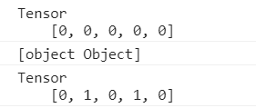
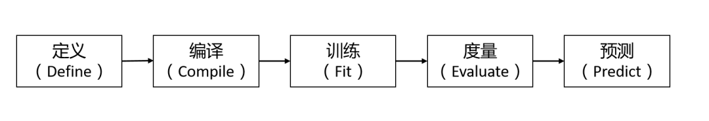
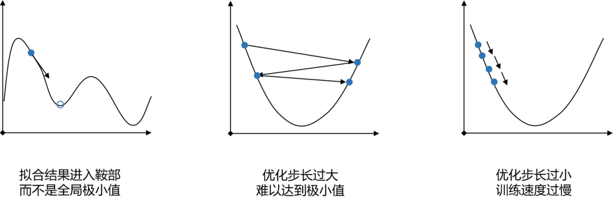

# Tensorflow.js入门
## 机器学习基础
### 什么是机器学习？
* 机器学习是对能通过经验自动改进的计算机算法的研究。
* 机器学习是用数据或以往的经验，以此优化计算机程序的性能标准。
### 机器学习如何运作？
* 神经网络。
* 决策树，支持向量机，贝叶斯分类器，强化学习等。
### 什么是神经网络？
* 神经网络指的是人工神经网络
* 人工神经网络是一种运算模型（就是输入输出的映射），由大量的节点（或称神经元）之间相互联接构成。
### 神经网络的训练
#### 概括
* 给大量输入和输出，算出神经网络里所有神经元的权重，偏置，然后给定新的输入，可以算出新的输出。
* 在机器学习里输入输出被称为特征和标签，大量输入输出被称为训练集。
#### 细节
* 初始化：随机生成一些权重和偏置。
* 计算损失：给定特征，计算出标签，得到它与真实标签差得多远。
* 优化：微调权重和偏置，使损失变小。
#### 计算损失
* 使用损失函数
* 损失函数有均方误差，对数损失，交叉熵等。
#### 优化
* 使用优化器
* 优化器有随机梯度下降（SGD），Adam等。
## Tensorflow.js基础
### Tensorflow.js是什么？
* 一个用javascript实现的机器学习库。
* 可以直接在浏览器和Node.js中使用机器学习技术。
### 具体功能
* 运行现有模型。
* 重新训练现有模型。
* 使用javascript从0开发机器学习模型。
### 安装
#### 在浏览器中安装
使用script标签引入TensorFlow.js。
```
<html>
  <head>
    <!-- Load TensorFlow.js -->
    <script src="https://cdn.jsdelivr.net/npm/@tensorflow/tfjs@3.0.0/dist/tf.min.js"></script>

    <!-- Place your code in the script tag below. You can also use an external .js file -->
    <script>
      // Notice there is no 'import' statement. 'tf' is available on the index-page
      // because of the script tag above.

      // Define a model for linear regression.
      const model = tf.sequential();
      model.add(tf.layers.dense({units: 1, inputShape: [1]}));

      // Prepare the model for training: Specify the loss and the optimizer.
      model.compile({loss: 'meanSquaredError', optimizer: 'sgd'});

      // Generate some synthetic data for training.
      const xs = tf.tensor2d([1, 2, 3, 4], [4, 1]);
      const ys = tf.tensor2d([1, 3, 5, 7], [4, 1]);

      // Train the model using the data.
      model.fit(xs, ys).then(() => {
        // Use the model to do inference on a data point the model hasn't seen before:
        // Open the browser devtools to see the output
        model.predict(tf.tensor2d([5], [1, 1])).print();
      });
    </script>
  </head>

  <body>
  </body>
</html>
```
使用NPM包安装，并使用Parcel，Webpack，vite等构建工具。
```
npm install @tensorflow/tfjs
```
```
import * as tf from '@tensorflow/tfjs';

//定义一个线性回归模型。
const model = tf.sequential();
model.add(tf.layers.dense({units: 1, inputShape: [1]}));

model.compile({loss: 'meanSquaredError', optimizer: 'sgd'});

// 为训练生成一些合成数据
const xs = tf.tensor2d([1, 2, 3, 4], [4, 1]);
const ys = tf.tensor2d([1, 3, 5, 7], [4, 1]);

// 使用数据训练模型
model.fit(xs, ys, {epochs: 10}).then(() => {
  // 在该模型从未看到过的数据点上使用模型进行推理
  model.predict(tf.tensor2d([5], [1, 1])).print();
  //  打开浏览器开发工具查看输出
});
```
#### 在Node.js中安装
安装带有原生C++绑定的TensorFlow.js
```
npm install @tensorflow/tfjs-node
或
npm install @tensorflow/tfjs-node-gpu
```
* 安装纯javascript版本，这个性能比较慢。
```
npm install @tensorflow/tfjs
```
### 张量(Tensor)
TensorFlow.js中数据的中心单位是张量：一组数值形成一个或多个维度的数组。 张量实例具有定义数组形状的形状属性。
Tensorflow.js中数据的主要表现形式就是tensor（张量）：由 一组数值形成一维或多维数组。一个Tensor实例有一个shape属性来定义这一组数值如何组成张量,而最主要的Tensor实例的构造函数就是 tf.tensor 函数，如下所示：
```
// 2x3 Tensor
const shape = [2, 3]; // 2 行, 3 列
const a = tf.tensor([1.0, 2.0, 3.0, 10.0, 20.0, 30.0], shape);
a.print(); // 打印张量值
// 输出:    [[1 , 2 , 3 ],
//          [10, 20, 30]]

// shape也可以用下面的方式实现:
const b = tf.tensor([[1.0, 2.0, 3.0], [10.0, 20.0, 30.0]]);
b.print();
// 输出:    [[1 , 2 , 3 ],
//          [10, 20, 30]]
```
但是，为了构造低秩张量，我们推荐使用下面的函数来增强代码的可读性：tf.scalar（零维）, tf.tensor1d（一维）, tf.tensor2d（二维）, tf.tensor3d（三维）、tf.tensor4d（四维）以及 tf.ones（值全是1）或者tf.zeros（值全是0） ，如下所示：
```
const a = tf.scalar(3.14);
a.print(); // 输出零维张量

const b = tf.tensor2d([[2, 3, 4], [5, 6, 7]]);
b.print(); // 输出二维张量

const c = tf.zeros([2, 3]);
c.print(); // 输出2行3列的值全是0的张量

const d = tf.ones([3, 5]);
d.print(); // 输出3行5列的值全是1的张量
```
在TensorFlow.js中，张量是不变的; 一旦创建你就不能改变它们的值。 但是，您可以对它们执行操作来生成新的张量。
### 变量(variables)
Variables变量是通过张量进行初始化得到的。不像Tensor的值不可变，变量的值是可变的。你可以使用变量的assign方法分配一个新的tensor到这个变量上，这是变量就会改变：
```
const initialValues = tf.zeros([5]);
const biases = tf.variable(initialValues); // 初始化biases
biases.print(); // 输出: [0, 0, 0, 0, 0]

const updatedValues = tf.tensor1d([0, 1, 0, 1, 0]);
biases.assign(updatedValues); // 更新 biases的值
biases.print(); // 输出: [0, 1, 0, 1, 0]
```
如上所示，首先使用tf.zeros得到一个张量，然后利用这个张量初始化得到一个变量，接着我们就可以打印这个变量，并且通Object.prototype.toString.call(biases)方法可以判断变量也是一个对象，接着，我们再生成一个张量，然后变量调用assign方法传入这个张量，就可以得到一个新的变量了，如下：

由此我们可以得出一个结论：变量由张量生成，且张量不可变而变量可变。
以上就是Tensorflow.js 张量和变量的相关介绍，希望对大家有所帮助。
### 操作(operations)
ensors 可以用保存数据，而 operations 可以操作数据。TensorFlow.js 提供了多种适用于张量的线性代数和机器学习的运算的 operations。由于张量是不可改变的，所以 operations 操作并不会改变 tensors 的值，而是返回新的张量。
#### operations 提供了类似 square 等一元运算
```
const x = tf.tensor1d([1, 2, Math.sqrt(2), -1]);
x.square().print();  // or tf.square(x)
// [1, 4, 1.9999999, 1]

const x = tf.tensor1d([1, 2, 4, -1]);
x.sqrt().print();  // or tf.sqrt(x)
// [1, 1.4142135, 2, NaN]
```
#### operations 提供了类似 add、sub 等二元运算
```
const a = tf.tensor1d([1, 2, 3, 4]);
const b = tf.tensor1d([10, 20, 30, 40]);

a.add(b).print();  // or tf.add(a, b)
// [11, 22, 33, 44]
```
#### 支持链式操作
```
const e = tf.tensor2d([[1.0, 2.0], [3.0, 4.0]]);
const f = tf.tensor2d([[5.0, 6.0], [7.0, 8.0]])
const sq_sum = e.add(f).square();
sq_sum.print();
// Output: [[36 , 64 ],
//          [100, 144]]

// 所有的操作都暴露在函数的命名空间中，也可以进行下面操作，得到相同的结果
const sq_sum = tf.square(tf.add(e, f));
```
### 模型(model)
机器学习中，一个 model 是一个带有可训练参数的函数。这个函数将输入转化为输出。通俗的来说，这个函数表达了输入和输出之间的变换关系。我们通过在数据集上训练模型来获得最佳参数。训练好的模型可以精确的将输入数据转换为我们想得到的输出。
TensorFlow.js 有两种创建机器学习的方法：
用 Layers API（用 layers 来创建模型）
用 Core API（底端算子，例如 tf.matMul() 或 tf.add() 等）来建立模型
我们首先会用高层API：Layers API来建立模型。然后，我们会展示如何用Core API来搭建相同的模型。
#### 用Layers API创建模型
Layers API有两种方式创建模型：第一种是创建 sequential 模型，第二种是创建 functional 模型。下面两段会分别解释这两种模型创建方式。
##### 使用sequential model
最常见的模型是 Sequential 模型。Sequential 模型将网络的每一层简单的叠在一起。您可以将需要的层按顺序写在一个列表里，然后将列表作为 sequential() 函数的输入：
```
const model = tf.sequential({
 layers: [
   tf.layers.dense({inputShape: [784], units: 32, activation: 'relu'}),
   tf.layers.dense({units: 10, activation: 'softmax'}),
 ]
});
```
或用 add() 方法：
```
const model = tf.sequential();
model.add(tf.layers.dense({inputShape: [784], units: 32, activation: 'relu'}));
model.add(tf.layers.dense({units: 10, activation: 'softmax'}));
```
> 注意：模型的第一层需要“输入形状”参数（inputShape）。不要在“输入型状”中包含 batch size（批次大小）。假设您要向模型输入一个形状为[B, 784]的张量（B 是任意batch size），您只需要将“输入型状”设为[784]。

您可以通过model.layers来使用模型中的每一层。例如，您可以用 model.inputLayers 和 model.outputLayers 来调用输入层和输出层。

##### 使用functional model
我们也可以通过 tf.model() 来创建 LayersModel。tf.model() 和 tf.sequential() 的主要区别为，您可以用 tf.model() 来创建任何非闭环的计算图。
以下是一段如何用 tf.model() API 建立和上文相同模型的列子：
```
// 用apply()方法创建任意计算图
const input = tf.input({shape: [784]});
const dense1 = tf.layers.dense({units: 32, activation: 'relu'}).apply(input);
const dense2 = tf.layers.dense({units: 10, activation: 'softmax'}).apply(dense1);
const model = tf.model({inputs: input, outputs: dense2});
```
我们在每一层用 apply() 将上一层的输出作为本层的输入。apply() 返回一个 SymbolicTensor（类似于张量，但不包含任何数值）
不同于 sequential model 使用 inputShape 来定义第一层的输入，我们用 tf.input() 创建的 SymbolicTensor 作为第一层的输入
如果您向 apply() 输入一个数值张量，它会进行计算并返还一个数值张量：
```
const t = tf.tensor([-2, 1, 0, 5]);
const o = tf.layers.activation({activation: 'relu'}).apply(t);
o.print(); // [0, 1, 0, 5]
```
这个方式适用于单独测试每一层并检查它们的输出。
和 sequential model 一样，您可以通过 model.layers 来使用模型中的每一层。例如，您可以用 model.inputLayers 和 model.outputLayers 来调用输入层和输出层。

#### 验证
Sequential model和functional model都属于 LayersModel类。使用 LayersModels 让验证更方便：它要求您定义输入形状，并用您定义的形状来验证您对模型的输入。LayersModel 会自动计算模型中所有张量的形状。知道张量的形状后，模型就可以自动创建它所需要的参数。您也可以用形状信息来判断两层相邻的层是否相互兼容。

#### 模型总览
使用 model.summary() 可以显示很多模型的重要信息，包括：

* 每一层的名字和类型
* 每一层的输出形状
* 每一层的权重数量
* 每一层的输入
* 一个模型拥有的可训练参数总量，和不可训练参数总量

用前面定义的模型来做例子，我们可以在命令行中得到以下信息：
| Layer (type) | Output shape | Param # |
| --- | --- | --- |
| dense_Dense1 (Dense) | [null,32] | 25120 |
| dense_Dense2 (Dense) | [null,10] | 330 |
|Total params: 25450 Trainable params: 25450 Non-trainable params: 0|
注意：每一层的输出形状中都含有 null 值。模型的输入形状包含了批次大小，而批次大小是可以灵活更变的，所以批次的值在张量形状中以 null 显示。

#### 序列化
相对于底端API而言，使用 LayersModel的另一个好处是方便存储、加载模型。LayersModel 包含如下信息：

* 可用于重建模型的模型架构信息
* 模型的权重
* 训练配置（例如损失函数，优化器和评估方式）
* 优化器的状态（可用于继续训练模型）

存储和加载模型只需要一行代码：
```
const saveResult = await model.save('localstorage://my-model-1');
const model = await tf.loadLayersModel('localstorage://my-model-1');
```
在这个例子中，模型被存储在浏览器的本地存储里。请访问 model.save() 和 save and load 了解如何把模型保存在不同的媒介中（例如 file storage, IndexedDB, 触发下载到浏览器等等）。

#### 自定义层
层是创建模型的基础。如果您的模型需要定制化计算模块，您可以写一个自定义层并插入模型中。下面的例子是一个计算平方和的自定义层：
```
class SquaredSumLayer extends tf.layers.Layer {
 constructor() {
   super({});
 }
 // In this case, the output is a scalar.
 computeOutputShape(inputShape) { return []; }

 // call() is where we do the computation.
 call(input, kwargs) { return input.square().sum();}

 // Every layer needs a unique name.
 getClassName() { return 'SquaredSum'; }
}
```
可以用 apply() 方法在一个张量上测试这个自定义层
```
const t = tf.tensor([-2, 1, 0, 5]);
const o = new SquaredSumLayer().apply(t);
o.print(); // prints 30
```

> 注意：如果您在模型中包含了自定义层，模型将不能序列化

#### 用Core API创建模型
本文开头提到了两种在 TensorFlow.js 中建立模型的方法。最常用的方式是使用 Layers API，因为它的模式是基于广泛应用的 Keras API（详情见 best practices and reduces cognitive load）。Layers API 提供了大量方便的工具，例如权重初始化，模型序列化，训练监测，可迁移性和安全检查。
当您遇到如下情况时，可能会需要使用 Core API：

* 您需要更多灵活性和控制
* 您不需要序列化或可以创造自己的序列化方法

用 Core API 写的模型包含了一系列的函数。这些函数以一个或多个张量作为输入，并输出另一个张量。我们可以用 Core API 来重写之前定义的模型：
```
// The weights and biases for the two dense layers.
const w1 = tf.variable(tf.randomNormal([784, 32]));
const b1 = tf.variable(tf.randomNormal([32]));
const w2 = tf.variable(tf.randomNormal([32, 10]));
const b2 = tf.variable(tf.randomNormal([10]));

function model(x) {
  return x.matMul(w1).add(b1).relu().matMul(w2).add(b2).softmax();
}
```
在 Core API 中，我们需要自己创建和初始化权重。每个权重都是一个 Variable，TensorFlow.js 会把 Variable 权重设为可训练张量。您可以用 tf.variable() 创建 Variable 或把一个已存在的张量放到 Variable 中。
### 内存管理(dispose&tidy)
因为TensorFlow.js使用了GPU来加速数学运算，因此当tensorflow处理张量和变量时就有必要来管理GPU内存。在TensorFlow.js中，我们可以通过dispose 和 tf.tidy这两种方法来管理内存。
#### dispose
您可以在张量或变量上调用dispose来清除它并释放其GPU内存：
```
const x = tf.tensor2d([[0.0, 2.0], [4.0, 6.0]]);
const x_squared = x.square();

x.dispose();
x_squared.dispose();
```
#### tf.tidy
进行大量的张量操作时使用dispose可能会很麻烦。 TensorFlow.js提供了另一个函数tf.tidy，它对JavaScript中的常规范围起到类似的作用，不同的是它针对GPU支持的张量。
tf.tidy执行一个函数并清除所有创建的中间张量，释放它们的GPU内存。 它不清除内部函数的返回值。
```
const average = tf.tidy(() => {
  const y = tf.tensor1d([1.0, 2.0, 3.0, 4.0]);
  const z = tf.ones([4]);

  return y.sub(z).square().mean();
});

average.print()
```
使用tf.tidy将有助于防止应用程序中的内存泄漏。它也可以用来更谨慎地控制内存何时回收。
#### 两个重要的注意事项
传递给tf.tidy的函数应该是同步的，并且不会返回Promise。我们建议在tf.tidy内不要有更新UI或在发出远程请求的代码。
tf.tidy不会清理变量。变量通常持续到机器学习模型的整个生命周期，因此TensorFlow.js不会清理它们，即使它们是在tidy中创建的。不过，您可以手动调用dispose处理它们。
## Tensorflow.js实战例子
TensorFlow.js的工作依然是围绕神经网络展开的，基本的工作过程包含了如下几个典型步骤：

下面将通过TensorFlow.js官方网站提供的数据拟合的示例来了解整个流程。
### Define
Define 阶段是使用TensorFlow.js的第一步，这个阶段中需要初始化神经网络模型，你可以在TensorFlow的tf.layers对象上找到具备各种功能和特征的隐藏层，通过模型实例的add方法将其逐层添加到神经网络中，从而实现张量变形处理、卷积神经网络、循环神经网络等复杂模型，当内置模型无法满足需求时，还可以自定义模型层，TensorFlow的高阶API可以帮助开发者以声明式的编码来完成神经网络的结构搭建，示例代码如下：
```
/*创建模型*/
function createModel() {
   const model = tf.sequential(); 
   model.add(tf.layers.dense({inputShape: [1], units: 1, useBias: true}));
   model.add(tf.layers.dense({units: 1, useBias: true}));
   return model;
}
```
### Compile
Compile阶段需要对训练过程进行一些参数预设，你可以先温习一下上一章中介绍过的BP神经网络的工作过程，然后再来理解下面的示例代码：
```
model.compile({
   optimizer: tf.train.adam(),
   loss: tf.losses.meanSquaredError,
   metrics: ['mse'],
});
```
loss（损失）用于定义损失函数，它是神经网络的实际输出和期望输出之间偏差的量化评估标准，最常用的损失函数就是均方差损失（tf.losses.meanSquaredError），其他损失函数可以在TensorFlow的API文档中进行查看；optimizer(优化器)是指误差反向传播结束后，神经网络进行权重调整时所使用的的算法。权重调整的目的就是为了使损失函数达到极小值，所以通常采用“梯度下降”的思想来进行逼近，梯度方向是指函数在某一点变化最显著的方向，但实际的情况往往并没有这么简单，假设下图是一个神经网络的损失函数曲线：

可以看到损失函数的形态、初始参数的位置以及优化过程的步长等都可能对训练过程和训练结果产生影响，这就需要在optimizer配置项中指定优化算法来达到较好的训练效果；metrics配置项用于指定模型的度量指标，大多数情况下可以直接使用损失函数来作为度量标准。
### Fit
Fit 阶段执行的是模型训练的工作（fit本身是拟合的意思），通过调用模型的fit方法就可以启动训练循环，官方示例代码如下(fit方法接收的参数分别为输入张量集、输出张量集和配置参数)：
```
const batchSize = 32;
const epochs = 50;

await model.fit(inputs, labels, {
   batchSize,
   epochs,
   shuffle: true,
   callbacks: tfvis.show.fitCallbacks(
      { name: 'Training Performance' },
      ['loss', 'mse'], 
      { height: 200, callbacks: ['onEpochEnd'] }
   )
});
```
相关参数说明如下（其他参数可参考官方开发文档）：

* batchSize（批大小）指每个循环中使用的样本数，通常取值为32~512
* epochs指定整个训练集上的数据的总循环次数
* shuffle指是否在每个epochs中打乱训练样本的次序
* callbacks指定了训练过程中的回调函数

神经网络的训练是循环进行的，假设总训练样本大小为320个，那么上面的示例代码所描述的训练过程是：先使用下标为0^31的样本来训练神经网络，然后使用optimizer来更新一次权重，再使用下标为32^63的样本进行训练，再更新权重，直到总样本中所有数据均被使用过一次，上述过程被称为一个epoch，接着打乱整个训练样本的次序，再重复共计50轮，callbacks回调函数参数直接关联了tfvis库，它是TensorFlow提供的专用可视化工具模块。
### Evaluate
Evaluate阶段需要对模型的训练结果进行评估，调用模型实例的evaluate方法就可以使用测试数据来获得损失函数和度量标准的数值。你可能已经注意到TensorFlow在定制训练过程时更加关注如何使用样本数据，而并没有将“度量指标小于给定阈值”作为训练终止的条件（例如brain.js中就可以通过设置errorthresh参数），在复杂神经网络的构建和设计中，开发者很可能需要一边构建一边进行非正式的训练测试，度量指标最终并不一定能够降低到给定的阈值以下，以此作为训练终止条件很可能会使训练过程陷入无限循环，所以使用固定的训练次数配合可视化工具来观察训练过程就更为合理。
### Predict
Predict阶段是使用神经网络模型进行预测的阶段，这也是前端工程师参与度最高的部分，毕竟模型输出的结果只是数据，如何利用这些预测结果来制作一些更有趣或者更加智能化的应用或许才是前端工程师更应该关注的问题。从前文的过程中不难看出，TensorFlow.js提供的能力是围绕神经网络模型展开的，应用层很难直接使用，开发者通常都需要借助官方模型仓库中提供的预训练模型或者使用其他基于TensorFlow.js构建的第三方应用，例如人脸识别框架face-api.js（它可以在浏览器端和Node.js中实现快速的人脸追踪和身份识别），语义化更加明确的机器学习框架ml5.js（可以直接调用API来实现图像分类、姿势估计、人物抠图、风格迁移、物体识别等更加具体的任务），可以实现手部跟踪的handtrack.js等等，如果TensorFlow的相关知识让你觉得过于晦涩，也可以先尝试使用这些更高层的框架来构建一些有趣的程序。

## 总结
以上是对Tensorflow.js的简单介绍，下边列出几个常用的链接，对学习Tensorflow.js有更加详细的了解
[TensorFlow.js中文官网](https://tensorflow.google.cn/js?hl=zh-cn)
[w3cschool](https://www.w3cschool.cn/tensorflowjs/)
[TensorFlow.js模型下载](https://www.kaggle.com/models)
[训练数据集](https://modelscope.cn/datasets)